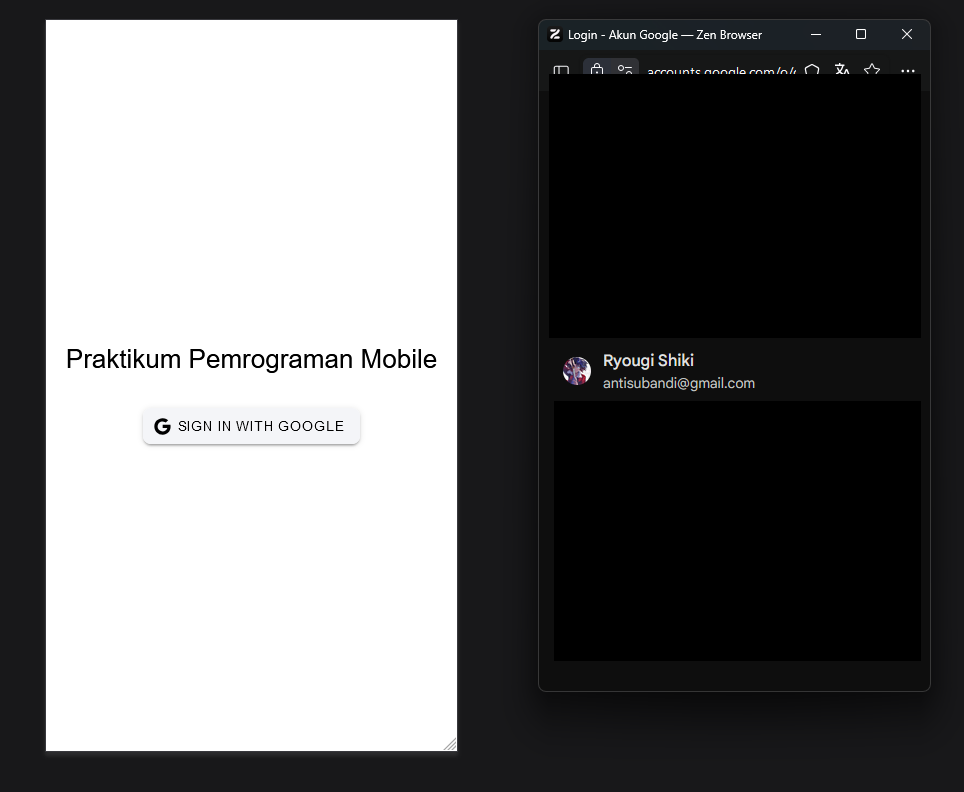
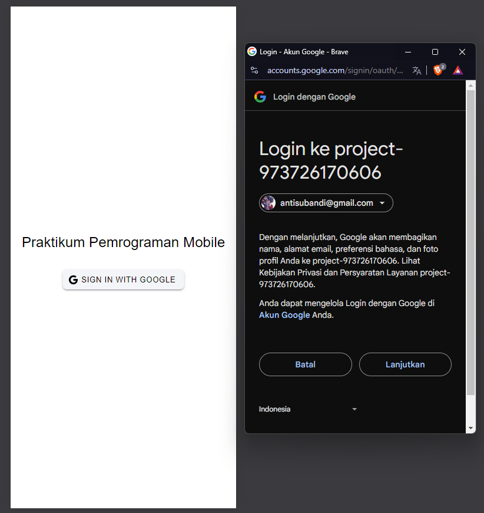
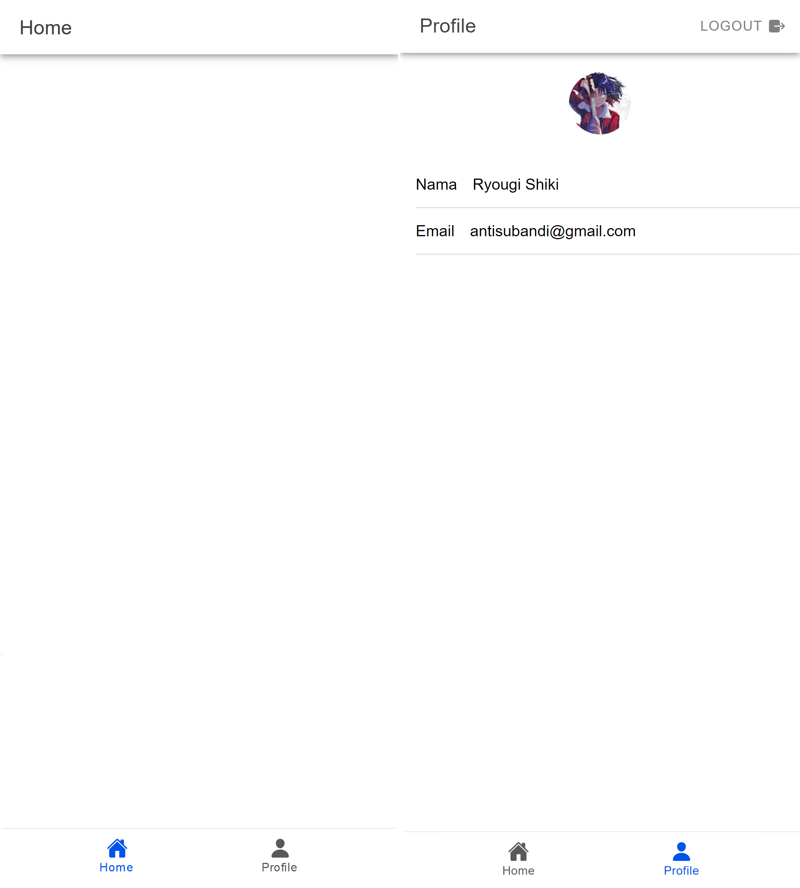

# Tugas 9 Praktikum Pemrograman Mobile

IONIC VUE FIREBASE IONIC VUE FIREBASE IONIC VUE FIREBASE

```yml
Nama: Panky Bintang Pradana Yosua
NIM: H1D022077
Shift Baru: F
Shift Lama: D
```

## Router

Mendefinisikan router-router yang digunakan pada aplikasi. terdapat router /, /login, /home, dan /profile. Lalu, terdapat property meta.isAuth dimana property ini digunakan untuk autorisasi (semacam state) yang digunakan ketika melakukan login dan logout. jika isAuth false, maka user harus dalam keadaan logout untuk melihat halaman tersebut. jika isAuth true maka user harus dalam kondisi telah login.

```ts
const routes: Array<RouteRecordRaw> = [
  {
    path: "/",
    redirect: "/login",
  },
  {
    path: "/login",
    name: "login",
    component: LoginPage,
    meta: {
      isAuth: false,
    },
  },
  {
    path: "/home",
    name: "home",
    component: HomePage,
    meta: {
      isAuth: true,
    },
  },
  {
    path: "/profile",
    name: "profile",
    component: ProfilePage,
    meta: {
      isAuth: true,
    },
  },
];
```

## 1. Login

Login dirender pada file `src\views\LoginPage.vue`. Login sangat sederhana, hanya menggunakan firebase library, sehingga kode yang dibuat cukup pendek. Setelah diklik akan diarahkan ke halaman google untuk melakukan login dengan memilih akun yang akan login.

```ts
const authStore = useAuthStore();

const login = async () => {
  await authStore.loginWithGoogle();
};
```

```html
<template>
  <ion-page>
    <ion-content :fullscreen="true">
      <div id="container">
        <!-- Title -->
        <ion-text style="margin-bottom: 20px; text-align: center">
          <h1>Praktikum Pemrograman Mobile</h1>
        </ion-text>

        <!-- Button Sign In -->
        <ion-button @click="login" color="light">
          <ion-icon slot="start" :icon="logoGoogle"></ion-icon>
          <ion-label>Sign In with Google</ion-label>
        </ion-button>
      </div>
    </ion-content>
  </ion-page>
</template>

<script setup lang="ts">
  import {
    IonContent,
    IonPage,
    IonButton,
    IonIcon,
    IonText,
    IonLabel,
  } from "@ionic/vue";
  import { logoGoogle } from "ionicons/icons";
  import { useAuthStore } from "@/stores/auth";

  const authStore = useAuthStore();

  const login = async () => {
    await authStore.loginWithGoogle();
  };
</script>

<style>
  #container {
    display: flex;
    flex-direction: column;
    justify-content: center;
    align-items: center;
    height: 100%;
  }

  ion-button {
    --border-radius: 8px;
  }
</style>
```

Proses yang terjadi adalah melakukan signIn dengan GoogleAuth, menyimpan credential yang didapatkan melalui response dari signIn tadi, lalu menyimpan IdToken pada provider GoogleAuth. Setelah itu melakukan signIn dengan credential dengan 2 parameter, auth dari firebase dan credential yang merupakan response dari signInWithCredential. Lalu menyimpan value dari user.value yang merupakan hasil response dari proses signIn tadi. Setelah itu diarahkan ke halaman /login.

```ts
const loginWithGoogle = async () => {
  try {
    await GoogleAuth.initialize({
      clientId: "9737*******************",
      scopes: ["profile", "email"],
      grantOfflineAccess: true,
    });

    const googleUser = await GoogleAuth.signIn();

    const idToken = googleUser.authentication.idToken;

    const credential = GoogleAuthProvider.credential(idToken);

    const result = await signInWithCredential(auth, credential);

    user.value = result.user;

    router.push("/home");
  } catch (error) {
    console.error("Google sign-in error:", error);

    const alert = await alertController.create({
      header: "Login Gagal!",
      message: "Terjadi kesalahan saat login dengan Google. Coba lagi.",
      buttons: ["OK"],
    });

    await alert.present();

    throw error;
  }
};
```



## 3. Konfirmasi

Setelah memilih akun, google akan meminta konfirmasi untuk melakukan login ke 3rd party app. Hal ini untuk memberikan consent tambahan (izin) sebagai tindakan pencegahan penipuan/hal buruk lainnya yang dapat terjadi di 3rd party app seperti aplikasi Ionic Vue Firebase ini.



## 4. Home dan Profile

Setelah tahap konfirmasi, user akan dialihkan ke halaman homepage (halaman utama) dari aplikasi ini. Tidak ada tampilan tambahan. Untuk menuju halaman profile dilakukan dengan klik logo profile pada pojok kanan bawah. Di halaman ini terdapat foto profile user yang sedang login dan data-data pribadi yang dimiliki. Foto dan data pribadi ini merupakan hasil response dari proses signIn dengan google. Google menawarkan data yang diberikan seperti display name, email, dan profile picture.

```ts
const authStore = useAuthStore();
const user = computed(() => authStore.user);
```



## 5. Logout

Logout dilakukan dengan klik tombol LOGOUT pada pojok kanan atas. Action ini akan request logout ke google, lalu menghapus state auth menjadi non login user. Setelah itu diarahkan ke halaman login.

```ts
const logout = async () => {
  try {
    await GoogleAuth.signOut();
    await signOut(auth);
    user.value = null;
    router.replace("/login");
  } catch (error) {
    console.error("Sign-out error:", error);
    throw error;
  }
};
```
