# Tugas 9 dan 10 Praktikum Pemrograman Mobile

IONIC VUE FIREBASE IONIC VUE FIREBASE IONIC VUE FIREBASE

```yml
Nama: Panky Bintang Pradana Yosua
NIM: H1D022077
Shift Baru: F
Shift Lama: D
```

- [Tugas 9 dan 10 Praktikum Pemrograman Mobile](#tugas-9-dan-10-praktikum-pemrograman-mobile)
  - [Tugas 9](#tugas-9)
    - [Route](#route)
    - [1. Login](#1-login)
    - [3. Konfirmasi](#3-konfirmasi)
    - [4. Home dan Profile](#4-home-dan-profile)
    - [5. Logout](#5-logout)
  - [Tugas 10 Todo List Firebase Vue Ionic](#tugas-10-todo-list-firebase-vue-ionic)
    - [1. Home](#1-home)
    - [2. Tambah Task dan Update Task](#2-tambah-task-dan-update-task)
    - [3. Update Status Task](#3-update-status-task)
    - [4. Delete Task](#4-delete-task)
    - [5. Build Aplikasi menjadi file `.apk`](#5-build-aplikasi-menjadi-file-apk)

## Tugas 9

### Route

Mendefinisikan router-router yang digunakan pada aplikasi. terdapat router /, /login, /home, dan /profile. Lalu, terdapat property meta.isAuth dimana property ini digunakan untuk autorisasi (semacam state) yang digunakan ketika melakukan login dan logout. jika isAuth false, maka user harus dalam keadaan logout untuk melihat halaman tersebut. jika isAuth true maka user harus dalam kondisi telah login.

```ts
const routes: Array<RouteRecordRaw> = [
  {
    path: "/",
    redirect: "/login",
  },
  {
    path: "/login",
    name: "login",
    component: LoginPage,
    meta: {
      isAuth: false,
    },
  },
  {
    path: "/home",
    name: "home",
    component: HomePage,
    meta: {
      isAuth: true,
    },
  },
  {
    path: "/profile",
    name: "profile",
    component: ProfilePage,
    meta: {
      isAuth: true,
    },
  },
];
```

### 1. Login

Login dirender pada file `src\views\LoginPage.vue`. Login sangat sederhana, hanya menggunakan firebase library, sehingga kode yang dibuat cukup pendek. Setelah diklik akan diarahkan ke halaman google untuk melakukan login dengan memilih akun yang akan login.

```ts
const authStore = useAuthStore();

const login = async () => {
  await authStore.loginWithGoogle();
};
```

```html
<template>
  <ion-page>
    <ion-content :fullscreen="true">
      <div id="container">
        <!-- Title -->
        <ion-text style="margin-bottom: 20px; text-align: center">
          <h1>Praktikum Pemrograman Mobile</h1>
        </ion-text>

        <!-- Button Sign In -->
        <ion-button @click="login" color="light">
          <ion-icon slot="start" :icon="logoGoogle"></ion-icon>
          <ion-label>Sign In with Google</ion-label>
        </ion-button>
      </div>
    </ion-content>
  </ion-page>
</template>

<script setup lang="ts">
  import {
    IonContent,
    IonPage,
    IonButton,
    IonIcon,
    IonText,
    IonLabel,
  } from "@ionic/vue";
  import { logoGoogle } from "ionicons/icons";
  import { useAuthStore } from "@/stores/auth";

  const authStore = useAuthStore();

  const login = async () => {
    await authStore.loginWithGoogle();
  };
</script>

<style>
  #container {
    display: flex;
    flex-direction: column;
    justify-content: center;
    align-items: center;
    height: 100%;
  }

  ion-button {
    --border-radius: 8px;
  }
</style>
```

Proses yang terjadi adalah melakukan signIn dengan GoogleAuth, menyimpan credential yang didapatkan melalui response dari signIn tadi, lalu menyimpan IdToken pada provider GoogleAuth. Setelah itu melakukan signIn dengan credential dengan 2 parameter, auth dari firebase dan credential yang merupakan response dari signInWithCredential. Lalu menyimpan value dari user.value yang merupakan hasil response dari proses signIn tadi. Setelah itu diarahkan ke halaman /login.

```ts
const loginWithGoogle = async () => {
  try {
    await GoogleAuth.initialize({
      clientId: "9737*******************",
      scopes: ["profile", "email"],
      grantOfflineAccess: true,
    });

    const googleUser = await GoogleAuth.signIn();

    const idToken = googleUser.authentication.idToken;

    const credential = GoogleAuthProvider.credential(idToken);

    const result = await signInWithCredential(auth, credential);

    user.value = result.user;

    router.push("/home");
  } catch (error) {
    console.error("Google sign-in error:", error);

    const alert = await alertController.create({
      header: "Login Gagal!",
      message: "Terjadi kesalahan saat login dengan Google. Coba lagi.",
      buttons: ["OK"],
    });

    await alert.present();

    throw error;
  }
};
```


### 3. Konfirmasi

Setelah memilih akun, google akan meminta konfirmasi untuk melakukan login ke 3rd party app. Hal ini untuk memberikan consent tambahan (izin) sebagai tindakan pencegahan penipuan/hal buruk lainnya yang dapat terjadi di 3rd party app seperti aplikasi Ionic Vue Firebase ini.


### 4. Home dan Profile

Setelah tahap konfirmasi, user akan dialihkan ke halaman homepage (halaman utama) dari aplikasi ini. Tidak ada tampilan tambahan. Untuk menuju halaman profile dilakukan dengan klik logo profile pada pojok kanan bawah. Di halaman ini terdapat foto profile user yang sedang login dan data-data pribadi yang dimiliki. Foto dan data pribadi ini merupakan hasil response dari proses signIn dengan google. Google menawarkan data yang diberikan seperti display name, email, dan profile picture.

```ts
const authStore = useAuthStore();
const user = computed(() => authStore.user);
```


### 5. Logout

Logout dilakukan dengan klik tombol LOGOUT pada pojok kanan atas. Action ini akan request logout ke google, lalu menghapus state auth menjadi non login user. Setelah itu diarahkan ke halaman login.

```ts
const logout = async () => {
  try {
    await GoogleAuth.signOut();
    await signOut(auth);
    user.value = null;
    router.replace("/login");
  } catch (error) {
    console.error("Sign-out error:", error);
    throw error;
  }
};
```

## Tugas 10 Todo List Firebase Vue Ionic

### 1. Home

Halaman Home diubah menjadi daftar tugas yang aktif dan yang telah diselesaikan. Halaman ini dirender oleh file `src\views\HomePage.vue`
Mendefinisikan bentuk tipe data dari Todo pada file `firestore.ts`:

```ts
export interface Todo {
  id?: string;
  title: string;
  description: string;
  status: boolean; // true = completed, false = active
  createdAt: Date;
  updatedAt: Date;
}
```

Halaman memanggil kode berikut untuk mendapatkan data Todos dari firebase.

```ts
const loadTodos = async (isLoading = true) => {
  let loading;
  if (isLoading) {
    loading = await loadingController.create({
      message: "Loading...",
    });
    await loading.present();
  }

  try {
    todos.value = await firestoreService.getTodos();
  } catch (error) {
    console.error(error);
  } finally {
    if (loading) {
      await loading.dismiss();
    }
  }
};
```

Setelah itu merender data Todo dengan fungsi berikut. Data ini mengembalikan promise berupa list Todo yang diambil yang diurutkan berdasarkan updatedAt secara descending. Jika berhasil mengembalikan list Todo, sedangkan jika gagal memberikan pesan Error.

```ts
async getTodos(): Promise<Todo[]> {
  try {
    const todoRef = this.getTodoRef();
    const q = query(todoRef, orderBy("updatedAt", "desc"));
    const snapshot = await getDocs(q);
    return snapshot.docs.map(
      (doc) =>
        ({
          id: doc.id,
          ...doc.data(),
        } as Todo)
    );
  } catch (error) {
    console.error("Error Get Todos:", error);
    throw error;
  }
},
```

| Home                                       |
| ------------------------------------------ |
| 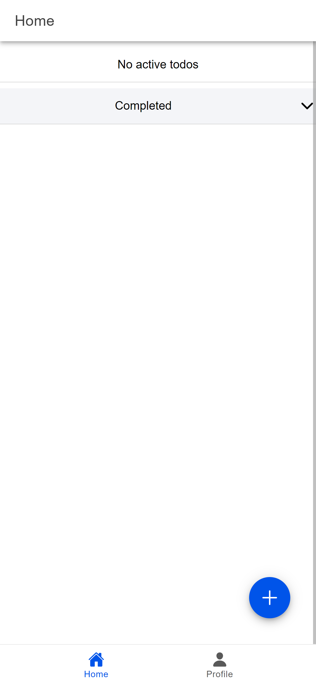 |

### 2. Tambah Task dan Update Task

Membuat modal dimana modal ini menangani proses Create dan Update.

```html
<InputModal
  v-model:isOpen="isOpen"
  v-model:editingId="editingId"
  :todo="todo"
  @submit="handleSubmit" />
```

Isi dari UI Modal Task untuk Tambah dan Ubah Task pada kode berikut.

```html
<ion-content>
  <ion-item>
    <ion-input
      v-model="todo.title"
      label="Title"
      label-placement="floating"
      placeholder="Enter Title"></ion-input>
  </ion-item>
  <ion-item>
    <ion-textarea
      v-model="todo.description"
      label="Description"
      label-placement="floating"
      placeholder="Enter Description"
      :autogrow="true"
      :rows="3"></ion-textarea>
  </ion-item>
  <ion-row>
    <ion-col>
      <ion-button
        type="button"
        @click="input"
        shape="round"
        color="primary"
        expand="block">
        {{ editingId ? "Edit" : "Add" }} Todo
      </ion-button>
    </ion-col>
  </ion-row>
</ion-content>
```

Untuk menambahkan task ataupun update task menggunakan fungsi berikut. Masukan yang diterima yaitu data todo tanpa `id`, `createdAt`, `updatedAt`, dan `status`.

Terdapat validasi jika tidak ada title, maka memunculkan notifikasi Toast `Title s required`.

Setelah itu melakukan pengecakan. Jika terdapat value dari `editingId.value`, maka masuk ke block `update`, setelah masuk melakukan update data todo yang dimaksud dengan mengirimkan value dari data todo yang diedit, setelah itu memberikan pesan `Todo updated successfully`.

Jika kondisi di atas tidak terpenuhi maka masuk ke block berikutnya, yaitu block `create` todo. Menambahkan Todo. Jika berhasil memberikan pesan `Todo added successfully`.

Jika proses di atas terdapat error maka masuk ke block catch pada try catch block. Memberikan notifikasi Toast bahwa suatu error terjadi dan mengirimkan pesan error pada console.

Setelah semua proses di atas, selanjutnya melakukan set value `editingId.value` (dari proses edit tadi) menjadi `null` supaya kosong.

```ts
const handleSubmit = async (
  todo: Omit<Todo, "id" | "createdAt" | "updatedAt" | "status">
) => {
  if (!todo.title) {
    await showToast("Title is required", "warning", warningOutline);
    return;
  }
  try {
    if (editingId.value) {
      await firestoreService.updateTodo(editingId.value, todo as Todo);
      await showToast("Todo updated successfully", "success", checkmarkCircle);
    } else {
      await firestoreService.addTodo(todo as Todo);
      await showToast("Todo added successfully", "success", checkmarkCircle);
    }
    loadTodos();
  } catch (error) {
    await showToast("An error occurred", "danger", closeCircle);
    console.error(error);
  } finally {
    editingId.value = null;
  }
};
```

Create Todo dilakukan dengan fungsi berikut. data yang diambil yaitu data task dengan tipe data dari interface Todo tanpa `id`. Jika berhasil akan mengembalikan id yang dimaksud, jika error maka mengembalikan pesan Error.

```ts
async addTodo(todo: Omit<Todo, "id">) {
  try {
    const todoRef = this.getTodoRef();
    const docRef = await addDoc(todoRef, {
      ...todo,
      status: false,
      createdAt: Timestamp.now(),
      updatedAt: Timestamp.now(),
    });
    return docRef.id;
  } catch (error) {
    console.error("Error Tambah Todo:", error);
    throw error;
  }
},
```

| Form Tambah Task                          | Berhasil Tambah Task                                |
| ----------------------------------------- | --------------------------------------------------- |
| 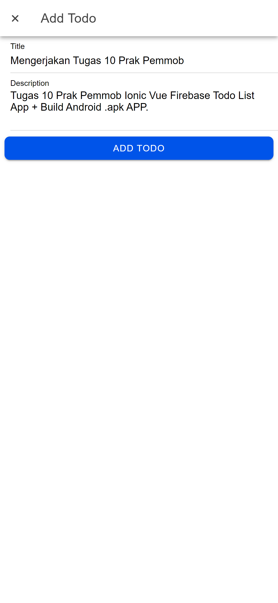 | 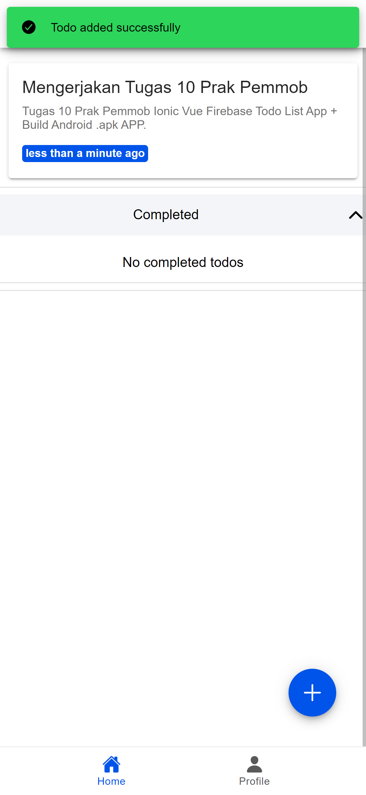 |

Sedangkan untuk melakukan Update Todo dilakukan dengan fungsi berikut.

```ts
async updateTodo(id: string, todo: Partial<Todo>) {
  try {
    const todoRef = this.getTodoRef();
    const docRef = doc(todoRef, id);
    await updateDoc(docRef, {
      ...todo,
      updatedAt: Timestamp.now(),
    });
  } catch (error) {
    console.error("Error Update Todo:", error);
    throw error;
  }
},
```

| Form Edit Task                                  | Berhasil Update Task                                 |
| ----------------------------------------------- | ---------------------------------------------------- |
| 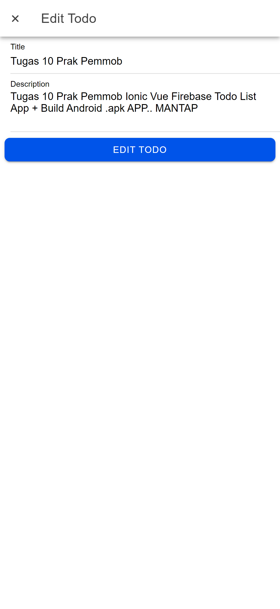 | 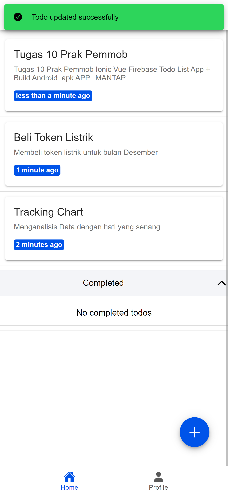 |

### 3. Update Status Task

Untuk update status Todo dilakukan dengan swipe Todo yang dimaksud. Setelah klik Icon Success untuk menandakan bahwa Todo complete ataupun Icon Warning untuk menandakan bahwa Todo tidak jadi complete.

```html
<ion-item-option color="success" expandable @click="handleStatus(todo)">
  <ion-icon
    slot="icon-only"
    :icon="checkmarkCircle"
    color="light"
    size="large"></ion-icon>
</ion-item-option>

<ion-item-option color="warning" expandable @click="handleStatus(todo)">
  <ion-icon
    slot="icon-only"
    :icon="close"
    color="light"
    size="large"></ion-icon>
</ion-item-option>
```

Dengan klik icon yang dimaksud akan trigger fungsi `handleStatus`.

```ts
const handleStatus = async (statusTodo: Todo) => {
  const slidingItem = itemRefs.value.get(statusTodo.id!);
  await slidingItem?.close();
  try {
    await firestoreService.updateStatus(statusTodo.id!, !statusTodo.status);
    await showToast(
      `Todo marked as ${!statusTodo.status ? "completed" : "active"}`,
      "success",
      checkmarkCircle
    );
    loadTodos();
  } catch (error) {
    await showToast("Failed to update status", "danger", closeCircle);
    console.error(error);
  }
};
```

Fungsi handle status di Atas memanggil fungsi updateStatus dengan data yang dikirimkan yaitu `id` dan `status`.

| Change Status to Complete                           | Change Status to Uncomplete                                 |
| --------------------------------------------------- | ----------------------------------------------------------- |
| 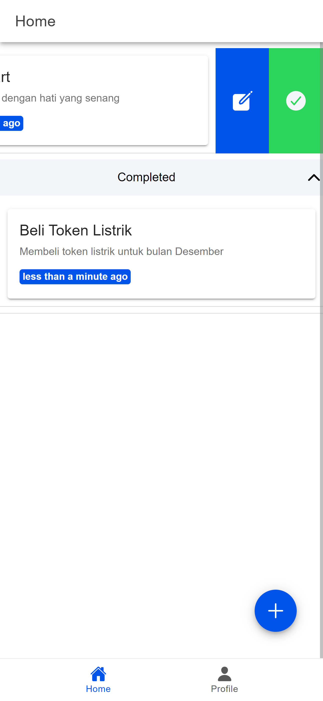 | 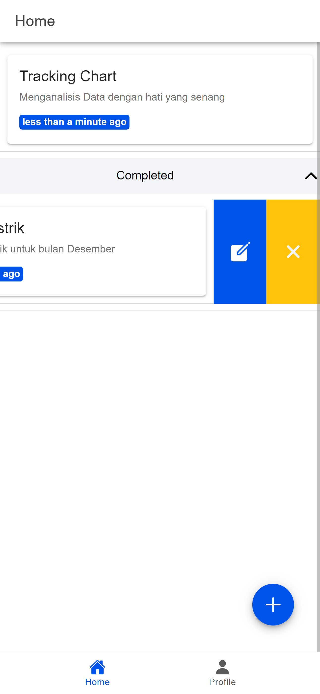 |

### 4. Delete Task

Menghapus Todo bisa dilakukan dengan 2 cara

- dilakukan dengan swipe keras todo yang dimaksud ke kanan
- dilakukan dengan swipe lembut todo lalu klik tombol Delete.

```html
<ion-item-options side="start" @ionSwipe="handleDelete(todo)">
  <ion-item-option color="danger" expandable @click="handleDelete(todo)">
    <ion-icon slot="icon-only" :icon="trash" size="large"></ion-icon>
  </ion-item-option>
</ion-item-options>
```

Kedua tindakan di atas akan memanggil fungsi `handleDelete` dengan data yang diterima yaitu data Todo. Fungsi ini akan memanggil fungsi `deleteTodo` pada firestoreService.

```ts
const handleDelete = async (deleteTodo: Todo) => {
  try {
    await firestoreService.deleteTodo(deleteTodo.id!);
    await showToast("Todo deleted successfully", "success", checkmarkCircle);
    loadTodos();
  } catch (error) {
    await showToast("Failed to delete todo", "danger", closeCircle);
    console.error(error);
  }
};
```

Fungsi `deleteTodo` pada firebaseService dipanggil dengan menerima id untuk menghapus todo dengan id yang dimaksud. Jika berhasil maka todo dari id tersebut terhapus, namun jika gagal akan memberikan pesan Error pada console.

```ts
async deleteTodo(id: string) {
  try {
    const todoRef = this.getTodoRef();
    const docRef = doc(todoRef, id);
    await deleteDoc(docRef);
  } catch (error) {
    console.error("Error Delete Todo:", error);
    throw error;
  }
}
```

| Tombol Hapus Task                            | Berhasil Hapus Task                               |
| -------------------------------------------- | ------------------------------------------------- |
| 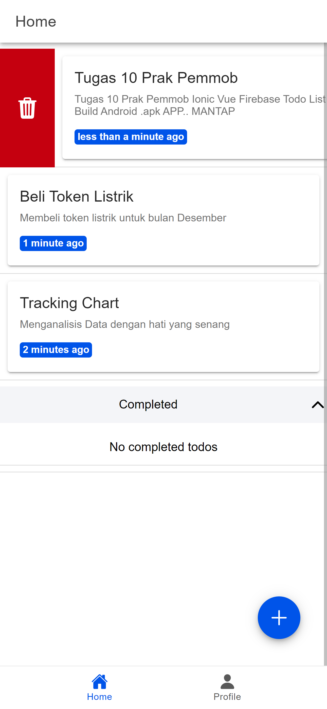 | ! 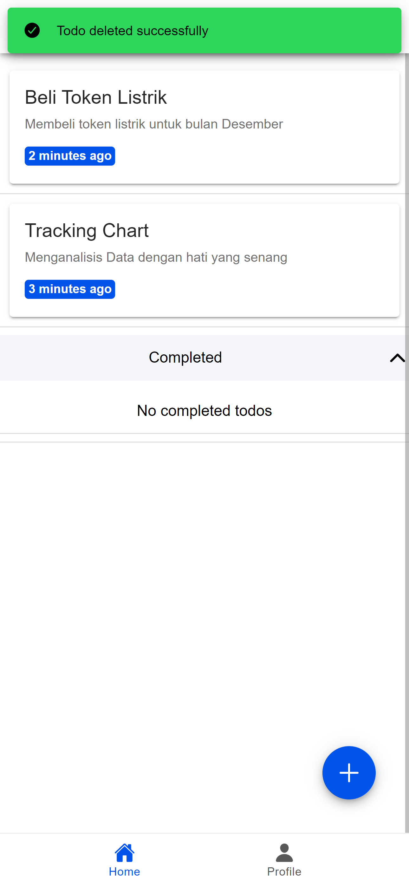 |

### 5. Build Aplikasi menjadi file `.apk`

1. Menjalankan perintah berikut pada CLI project.

```bash
ionic capacitor add android
```

2. Lalu melakukan build aplikasi android

```bash
ionic build
```

3. Setelah itu melakukan sinkronisasi aplikasi android yang telah dibuild dengan capacitor

```bash
ionic cap sync android
```

4. Generate SHA-1 ataupun SHA-256

Generate key ini supaya dapat login firebase melalui sistem operasi android. caranya yaitu dengan mengetikkan command berikut pada folder `/android`.

```bash
./gradlew signingReport
```

Perintah di atas akan menghasilkan output seperti di bawah pada terminal:

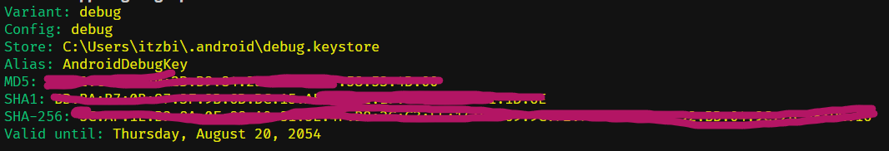

5. Menambahkan App Android pada Firebase
   1. Masuk ke Project Settings
   2. General (scroll) hingga section `Your apps`
   3. Tambahkan aplikasi android.
      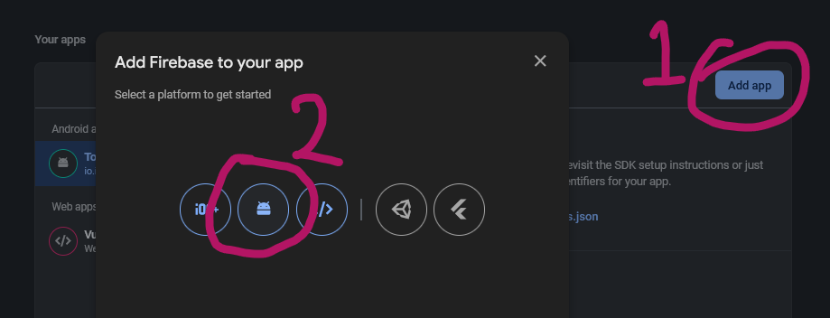
   4. Ikut langkah langkahnya dengan memasukkan app_id dan SHA1

| app_id                            | SHA1                         |
| --------------------------------- | ---------------------------- |
| 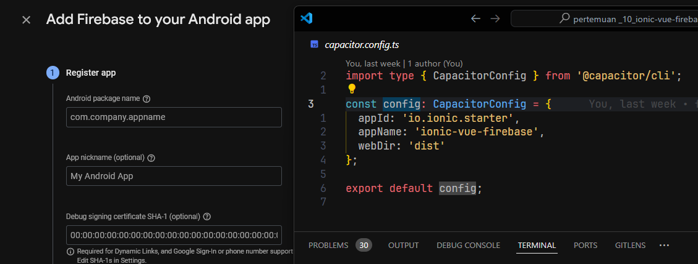 |  |

6. Kemudian Build project menjadi `/.apk` pada Android Studio

```bash
ionic cap open android
```

Hal ini dapat dilakukan dengan membuka folder android pada Android Studio. Kemudian pilih menu `BUild`, setelah itu pilih `Build App Bundle(s) / APK(s)`, kemudian pilih `Build APK(s)`.

.png>)

Dengan hal di atas, gradle akan melakukan build aplikasi Ionic.

Hasil dari build tersebut dapat dibuka melalui direktori berikut `android\app\build\outputs\apk\debug\app-debug.apk`

Setelah itu, aplikasi `.apk` tersebut bisa di install pada sistem operasi Android.

| Direktori Build .apk                                    | Hasil Aplikasi yang telah diinstall                                                                 | Aplikasi Telah Diinstall                                                           |
| ------------------------------------------------------- | --------------------------------------------------------------------------------------------------- | ---------------------------------------------------------------------------------- |
|  |  |  |
